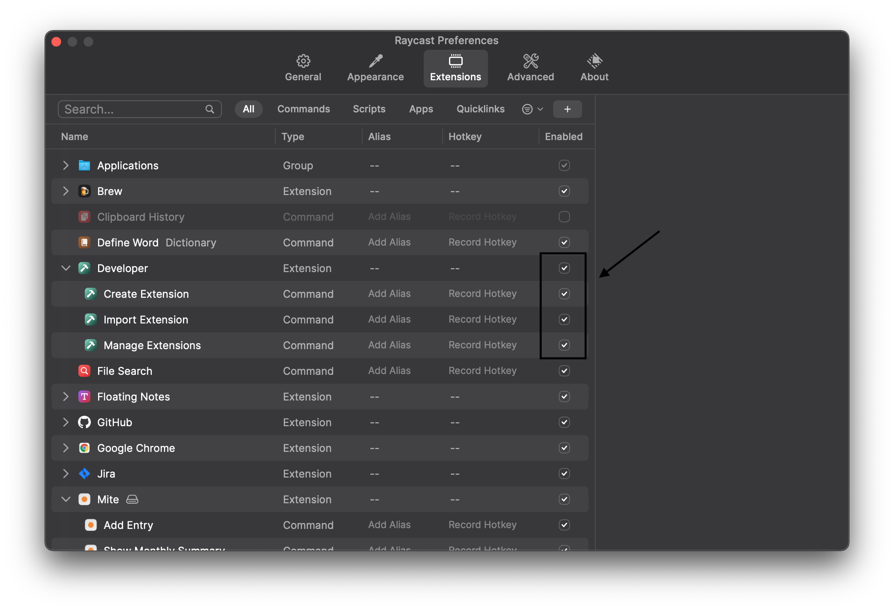

# Raycast Plugin

Allows the usage of [mite](https://mite.yo.lk/) with [Raycast](https://www.raycast.com/) launcher.

## Installation

1. Clone this repo to any location on your mac

2. Build and install the dependencies by `npm install && npm run build` in the extension folder

3. Install Raycast if you have not already. `brew install --cask raycast`

4. In Raycast > Settings > Extensions enable Developer extension to allow installation of extensions from source 

5. Import Extensions by opening Raycast and selecting `Import Extension`. In the file dialog select the `raycast-mite` clone target folder from step 1.

## Development

If you want to improve this extension yourself simply run `npm run dev` in the extension folder. This will start a dev server and all changes to the extension will be directly visible in Raycast.
